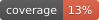

# Proyección de anegamientos — regiones de Coquimbo, Atacama y Antofagasta

[](https://github.com/mherreradsci/flood-projections-chile/actions/workflows/ci.yml)


Sistema en Python para estimar **dónde se producirán anegamientos** ante un
evento de precipitación extrema (río atmosférico de julio 2026) y detectar los
**puntos nuevos** sin registro histórico de inundación. 100% herramientas de
código abierto y datos públicos. Multi-región: cada región es un archivo de
configuración (ver [Multi-región](#multi-región)).

**Este es un producto de susceptibilidad, no un mapa de certeza**: el modelo
sobrepredice extensión a propósito (ver [Limitaciones](#limitaciones)) y no
reemplaza los avisos oficiales de la DMC ni de SENAPRED.


*Salida real del pipeline (GFS, ciclo 00 UTC del 17-jul-2026) sobre Punitaqui:
zonas nuevas de anegamiento en rojo y servicios críticos expuestos.*

## Método

Dos conceptos base:

- **DEM** (*Digital Elevation Model*, modelo digital de elevación): raster
  donde cada celda (~30 m aquí) guarda la altura del terreno sobre el nivel
  del mar. Es el "mapa en 3D" del que se deriva todo lo demás.
- **HAND** (*Height Above Nearest Drainage*): cuántos metros más arriba está
  cada celda respecto del **cauce al que drena** siguiendo la dirección del
  flujo — no de la altura sobre el mar. Si una crecida sube N metros, se
  anegan las celdas con HAND < N; por eso una terraza baja junto a un río
  puede ser más riesgosa que un cerro costero.

Modelo semi-hidrológico **HAND calibrado**:

1. **Terreno**: DEM Copernicus GLO-30 → direcciones de flujo, acumulación, red
   de drenaje y HAND (Height Above Nearest Drainage) con `pysheds`.
2. **Lluvia efectiva**: precipitación GFS 0.25° (o escenario sintético)
   filtrada por la **isoterma 0** — solo el área bajo la cota de nieve aporta
   escorrentía líquida, el mecanismo dominante en crecidas chilenas.
3. **Escorrentía**: SCS Curve Number (CN desde ESA WorldCover) por subcuenca
   HydroBASINS.
4. **Extensión**: el volumen de escorrentía se distribuye en el espacio HAND
   de cada subcuenca (estilo FwDET) → raster de profundidad.
5. **Calibración**: factores de volumen por subcuenca ajustados contra huellas
   de inundación observadas (Global Flood Database MODIS 250 m para 2002;
   máscaras de agua Sentinel-1 vía openEO para 2015 y 2017).
6. **Zonas nuevas**: extensión proyectada − huellas históricas.

## Uso

```bash
python3 -m venv .venv && .venv/bin/pip install -r requirements.txt
.venv/bin/python scripts/01_descargar_datos.py    # insumos + GFS vigente (--sin-pronostico para omitirlo)
.venv/bin/python scripts/02_preparar_terreno.py   # HAND (lento, se cachea)
.venv/bin/python scripts/03_calibrar.py           # contra eventos históricos
.venv/bin/python scripts/04_proyectar.py --fuente gfs
```

### Multi-región

Cada región vive en su propio archivo de configuración: `config.yaml` es la
región por defecto (Coquimbo), `config_atacama.yaml` la Región de Atacama y
`config_antofagasta.yaml` la Región de Antofagasta. Los cuatro scripts aceptan
`--config`; sin ese flag usan `config.yaml`:

```bash
# Coquimbo (config.yaml, por defecto)
.venv/bin/python scripts/04_proyectar.py --fuente gfs

# Atacama: mismo pipeline, otro config. Los pasos 01-03 son una sola vez
# por región (cachean por existencia); la operación recurrente es el 04.
.venv/bin/python scripts/01_descargar_datos.py --config config_atacama.yaml
.venv/bin/python scripts/02_preparar_terreno.py --config config_atacama.yaml
.venv/bin/python scripts/03_calibrar.py --config config_atacama.yaml
.venv/bin/python scripts/04_proyectar.py --fuente gfs --config config_atacama.yaml
```

El `region.id` de cada config define la subcarpeta donde vive su estado
(`data/coquimbo/`, `outputs/atacama/`, `publicacion/atacama/`, …), así que
las regiones no comparten archivos y pueden correr en paralelo.

Para agregar una región nueva: copiar `config.yaml` a `config_<region>.yaml`,
definir `region.id`, `nombre`, `osm_geocode` y `bbox`, redefinir
`calibracion.eventos` con eventos/huellas de esa región (ver los comentarios
de `config_atacama.yaml` como guía del proceso, incluida la verificación de
cobertura GFD/Sentinel-1) y correr 01→02→03→04 con `--config`.

Antofagasta (agregada tras el sistema frontal del 17-19 de agosto de 2026:
alerta roja SENAPRED en cuatro comunas, aluviones en Tocopilla, corte de la
Ruta 1 con desvío del tráfico a la Ruta 5 Norte) es el caso extremo de región
hiperárida: en régimen normal (~2-4 mm/año) el modelo da 0 km² por diseño
(bajo el umbral de abstracción inicial `Ia` SCS-CN no produce escorrentía),
así que el producto vive de los eventos excepcionales — el escenario sintético
`frontal_30mm` replica el evento de agosto 2026 de forma reproducible, y los
ciclos GFS/IFS reales del evento se rellenaron con
`reprocesar_ciclo_{gfs,ifs}.py` (ver backfill más abajo).

Cada corrida del paso 04 publica además su mapa con nombre estable en
`publicacion/<region>/mapa_<fuente>.html` y actualiza
`publicacion/manifest.json` — índice global (regiones + ítems con fuente,
ciclo y acumulados) pensado para servicios externos de visualización.

Utilitario: `scripts/ciclo_vigente.py` muestra qué ciclos GFS ya publicaron el
horizonte completo (72 h) en NOAA — el más reciente de ellos es el que usará
`--fuente gfs` — sin descargar datos (solo HEAD a los `.idx` del bucket
`noaa-gfs-bdp-pds`).

Utilitario: `scripts/reprocesar_ciclo_gfs.py --ciclo 2026-07-23T06 [--config
config_atacama.yaml] [--publicar]` rellena huecos en `outputs/<region>/` para
ciclos GFS puntuales del pasado (p. ej. tras una caída del cron) sin pisar el
mapa publicado — por defecto no toca `publicacion/`, salvo que se pase
`--publicar`.

`--ciclo` es repetible: una sola llamada puede reprocesar varios ciclos en
secuencia (por ejemplo, todo un evento). Así se rellenaron los 25 ciclos GFS
de Atacama entre el 2026-07-12T00 y el 2026-07-18T00 (cada 6 h):

```bash
.venv/bin/python scripts/reprocesar_ciclo_gfs.py --config config_atacama.yaml \
  --ciclo 2026-07-12T00 --ciclo 2026-07-12T06 --ciclo 2026-07-12T12 --ciclo 2026-07-12T18 \
  --ciclo 2026-07-13T00 --ciclo 2026-07-13T06 --ciclo 2026-07-13T12 --ciclo 2026-07-13T18 \
  --ciclo 2026-07-14T00 --ciclo 2026-07-14T06 --ciclo 2026-07-14T12 --ciclo 2026-07-14T18 \
  --ciclo 2026-07-15T00 --ciclo 2026-07-15T06 --ciclo 2026-07-15T12 --ciclo 2026-07-15T18 \
  --ciclo 2026-07-16T00 --ciclo 2026-07-16T06 --ciclo 2026-07-16T12 --ciclo 2026-07-16T18 \
  --ciclo 2026-07-17T00 --ciclo 2026-07-17T06 --ciclo 2026-07-17T12 --ciclo 2026-07-17T18 \
  --ciclo 2026-07-18T00
```

Toda la llamada —sin importar cuántos `--ciclo` lleve— queda en un solo
archivo de log, `outputs/<region>/logs/reprocesar_<timestamp>.log` (mismo
directorio y formato que usa `correr_proyeccion_gfs.sh` para `04_proyectar.py`),
con un bloque `== inicio ==`/`== fin ==` por corrida y una línea por ciclo
procesado.

### Parámetros de `04_proyectar.py`

| Parámetro | Valores | Defecto | Descripción |
|---|---|---|---|
| `--fuente` | `gfs` \| `ifs` \| `escenario` | `gfs` | Origen de la lluvia: pronóstico GFS 0.25° (NOAA), pronóstico IFS 0.25° (ECMWF open-data) o escenario sintético definido en `config.yaml`. Con `gfs`/`ifs` descarga el ciclo vigente antes de modelar. |
| `--escenario NOMBRE` | un nombre de la sección `escenarios:` del config de la región (Coquimbo: `extremo_200mm`, `moderado_100mm`, `costero_120mm`; Atacama: `extremo_100mm`, `moderado_50mm`, `costero_70mm`; Antofagasta: `extremo_60mm`, `frontal_30mm`, `moderado_15mm`) | `extremo_200mm` | Escenario sintético a usar; solo tiene efecto con `--fuente escenario`. |
| `--sin-exposicion` | flag (sin valor) | desactivado | Omite la consulta Overpass/OSM de vías y servicios expuestos; el mapa se genera sin esa capa. Si la consulta falla, el script continúa igual con una advertencia. |

Ejemplos:

```bash
.venv/bin/python scripts/04_proyectar.py --fuente ifs
.venv/bin/python scripts/04_proyectar.py --fuente escenario --escenario extremo_200mm
.venv/bin/python scripts/04_proyectar.py --fuente escenario --escenario moderado_100mm --sin-exposicion
```

Resultado principal:
`outputs/<region>/mapa_anegamientos_<fuente>[_<AAAAMMDD>_<HH>utc]_<AAAAMMDD-HHMMSS>.html`
(folium, capas conmutables; el tag `_<AAAAMMDD>_<HH>utc` aparece solo con
pronósticos e indica día y ciclo usados, de modo que ordenar por nombre de
archivo ordena por ciclo) más GeoTIFF/GeoJSON en `outputs/<region>/` (p. ej. `outputs/coquimbo/`), sufijados por fuente
(`extension_gfs.tif`, `zonas_nuevas_extremo_200mm.geojson`, …).

### Corridas programadas (cron)

`scripts/correr_proyeccion_{,atacama_,antofagasta_}{gfs,ifs}.sh` son los
wrappers para cron/systemd (uno por región × fuente): rutas absolutas, candado `flock`
contra corridas solapadas y log por corrida en
`outputs/<region>/logs/proyeccion_{gfs,ifs}_<timestamp>.log`.

Las horas de ejecución deben seguir la publicación de cada fuente. Cada
ciclo (00, 06, 12, 18 UTC) tarda en estar listo: GFS completa su horizonte de
72 h ~4 h después de la hora del ciclo; IFS 0.25° open-data tarda más,
~6.5 h (medido 2026-07-30: el ciclo 06z quedó publicado a las 12:27 UTC). En
ambos casos el pipeline resuelve solo "el ciclo más reciente" con su propio
mecanismo de reintento (`sondear_ciclos_gfs` para GFS, `Client.latest()` de
`ecmwf-opendata` para IFS) y cae al ciclo anterior si el más nuevo no está
listo — **la corrida recurrente nunca falla por esto**, el horario del cron
solo decide qué tan fresco es el dato que trae.

**Ojo con la zona horaria:** cron corre en la hora local del sistema
(`America/Santiago`, verificar con `timedatectl`), no en UTC — las horas de
abajo (1, 7, 13, 19 locales) equivalen a UTC 5, 11, 17, 23 en horario de
invierno (UTC−4), es decir ciclo+5h. Con eso, IFS ya queda con ~4.5 h de
margen sobre el retraso medido; no hace falta ni conviene acercar más el
horario a la hora de publicación real (el margen se reduce a minutos y
cualquier día que ECMWF se demore un poco más, sale 404).

Ejemplo vigente (agosto 2026, con guardia de año y entradas de autolimpieza
que se borran a sí mismas y a las de corridas el 31 de agosto):

```cron
0 1,7,13,19 * * * [ "$(date +\%Y)" = "2026" ] && /home/mherrera/Proyectos/meteorologia/meteorologia-flood-projections/scripts/correr_proyeccion_gfs.sh # proyeccion-gfs-ago2026
15 1,7,13,19 * * * [ "$(date +\%Y)" = "2026" ] && /home/mherrera/Proyectos/meteorologia/meteorologia-flood-projections/scripts/correr_proyeccion_atacama_gfs.sh # proyeccion-atacama-gfs-ago2026
20 1,7,13,19 * * * [ "$(date +\%Y)" = "2026" ] && /home/mherrera/Proyectos/meteorologia/meteorologia-flood-projections/scripts/correr_proyeccion_antofagasta_gfs.sh # proyeccion-antofagasta-gfs-ago2026
30 19 31 8 * crontab -l | grep -v proyeccion-gfs-ago2026 | crontab - # proyeccion-gfs-ago2026
45 19 31 8 * crontab -l | grep -v proyeccion-atacama-gfs-ago2026 | crontab - # proyeccion-atacama-gfs-ago2026
35 19 31 8 * crontab -l | grep -v proyeccion-antofagasta-gfs-ago2026 | crontab - # proyeccion-antofagasta-gfs-ago2026

30 1,7,13,19 * * * [ "$(date +\%Y)" = "2026" ] && /home/mherrera/Proyectos/meteorologia/meteorologia-flood-projections/scripts/correr_proyeccion_ifs.sh # proyeccion-ifs-ago2026
45 1,7,13,19 * * * [ "$(date +\%Y)" = "2026" ] && /home/mherrera/Proyectos/meteorologia/meteorologia-flood-projections/scripts/correr_proyeccion_atacama_ifs.sh # proyeccion-atacama-ifs-ago2026
50 1,7,13,19 * * * [ "$(date +\%Y)" = "2026" ] && /home/mherrera/Proyectos/meteorologia/meteorologia-flood-projections/scripts/correr_proyeccion_antofagasta_ifs.sh # proyeccion-antofagasta-ifs-ago2026
50 19 31 8 * crontab -l | grep -v proyeccion-ifs-ago2026 | crontab - # proyeccion-ifs-ago2026
55 19 31 8 * crontab -l | grep -v proyeccion-atacama-ifs-ago2026 | crontab - # proyeccion-atacama-ifs-ago2026
40 19 31 8 * crontab -l | grep -v proyeccion-antofagasta-ifs-ago2026 | crontab - # proyeccion-antofagasta-ifs-ago2026
```

Backfill puntual de un ciclo exacto (huecos por caída del cron, o para
rellenar historia): `scripts/reprocesar_ciclo_gfs.py` y
`scripts/reprocesar_ciclo_ifs.py`, misma interfaz `--ciclo` (repetible)
`[--config config_atacama.yaml] [--publicar] [--forzar]`, ver ejemplo de GFS
más arriba (sección [Multi-región](#multi-región)). A diferencia de la
corrida recurrente, estos SÍ pueden fallar con
`HTTPError 404` si se pide un ciclo de IFS/GFS del día antes de que la fuente
lo publique, o un ciclo futuro (este último se corta antes de tocar red).

## Datos usados (todos públicos)

| Insumo | Fuente |
|---|---|
| DEM 30 m | Copernicus GLO-30 (AWS Open Data) |
| Pronóstico | GFS 0.25° vía `herbie-data` (NOAA) o IFS 0.25° vía `ecmwf-opendata` |
| Huellas históricas | Global Flood Database v1.4 (GCS `gfd_v1_4`) |
| Huellas 2015/2017 | Sentinel-1 GRD vía openEO (Copernicus Dataspace) |
| Uso de suelo | ESA WorldCover 10 m (AWS) |
| Subcuencas | HydroSHEDS HydroBASINS nivel 8 |
| Límite regional | OpenStreetMap (Nominatim) |
| Exposición | OpenStreetMap (Overpass vía `osmnx`) |

El pronóstico IFS es [ECMWF open data](https://www.ecmwf.int/en/forecasts/datasets/open-data)
bajo licencia [CC BY 4.0](https://creativecommons.org/licenses/by/4.0/), que
exige atribución — el título de cada mapa generado con `--fuente ifs` la
incluye (`datos © ECMWF`). GFS es dominio público (NOAA) y no la requiere.

## Limitaciones

- GFS 25 km es grueso para quebradas costeras; usar el modo escenario para
  forzar acumulados locales.
- La calibración usa tres eventos: agosto de 2002 (DFO 2042, la **única**
  huella MODIS sobre Coquimbo en el Global Flood Database — los aluviones de
  2015 y 2017 no fueron procesados por GFD v1.4) más marzo 2015 y mayo 2017
  con máscaras de agua Sentinel-1 (openEO/Copernicus Dataspace). Las huellas
  satelitales subdetectan agua somera o breve, por lo que el modelo se calibra
  al corredor que captura el 80% de la observación (POD≈0.8) y **tiende a
  sobrepredecir extensión** — es un producto de susceptibilidad, no un mapa de
  certeza.
- El modelo representa anegamiento fluvial/de quebradas, no fallas de
  colectores urbanos.
- **Esto no reemplaza los avisos oficiales de la DMC ni de SENAPRED.**
